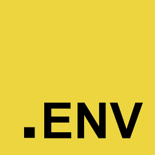
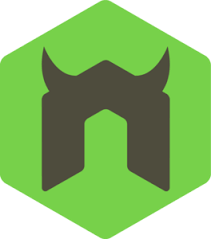

# Job Listing API

### Table of Contents
* [Prerequisites](#Prerequisites)
* [Tech Stack](#Tech-Stack)
* [Getting Started](#Getting-Started)
* [Project Structure](#Project-Structure)
* [Author](#Author)

#
### Prerequisites


*  *npm @8 and up*
*  *typescript*

#
### Tech Stack

*  *Express @4.18.2 - JS web framework*
*  *MongoDB @4.12.1 - DataBase*
*  *Mongoose @6.8.0 - MongoDB object modeling tool*
*  *Dotenv @16.0.3 -  JS library for loading environment variables*
*  *Cors @2.8.5 -  security feature*
*  *Nodemon @2.0.20 -  utility that automatically restarts a Node.js server*


#
### Getting Started
1. First of all you need to clone app repository from github:
```
git clone git@github.com:beqa200/job-listing-api.git
```
2. Next step requires install all the dependencies.

```
npm install
```
3. To start server 

```
nodemon
```

#
### Project Structure

```
|--- controllers
|   |--- jobs.ts # create get request
|--- models
|   |--- jobs.ts # connecting to mongodb and write schema for data
|--- utils
|   |--- config.ts # declare port
- app.ts # add middlewares
- main.ts # entry file


```


#
### Author
* [LinkedIn](https://www.linkedin.com/in/beqa-maisuradze-76a730234/)
